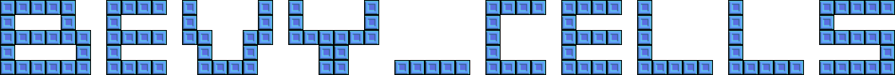

[](https://crates.io/crates/bevy_cells)
[](https://docs.rs/bevy_cells/latest/bevy_cells/)

A general purpose grided entity library meant to support tilemap libraries, or other libraries that require accessing entities in a grid based manner built on top of the [`aery`](https://github.com/iiYese/aery) relations crate.  The goal is to keep the API surface as simple and intuitive as possible, and to avoid deferred operations/states where possible to make the structures more intuitive work with (ex: an update in one system should be seen by the following system, not the following frame.). 

# Features

Currently, `bevy_cells` supports the following:
* Automatic chunking (including access to chunk entities)
* Automatic map creation
* Hierarchical despawning of chunks and maps
* N-dimensional map support
* Map based quiries
* Spatial queries
* Batched operations for better performance on large groups of cells or chunks

Upcoming features:
* Automatigically handle hierarchical deletes (via aery support or supported directly in this crate)
* Sort cells in memory based on chunk and map (will require bevy API additions in the future)

# API

The basic API revolves around `CellQuery`'s, `CellCommands`, and `CellMapLabel`'s as seen below.

```rust
struct GameLayer;

impl CellMapLabel for GameLayer {
    const CHUNK_SIZE: usize = 16;
}

fn move_character(
    keyboard_input: Res<Input<KeyCode>>,
    mut commands: Commands,
    character: CellQuery<GameLayer, CellCoord, With<Character>>,
    walls: CellQuery<GameLayer, (), With<Block>>,
) {
    let mut cell_commands = commands.cells::<GameLayer, 2>();

    let mut x = if keyboard_input.just_pressed(KeyCode::A) {
        -1
    } else {
        0
    };

    x += if keyboard_input.just_pressed(KeyCode::D) {
        1
    } else {
        0
    };

    let char_c = character.single();
    let new_coord = [char_c[0] + x, char_c[1] + y];

    if walls.get_at(new_coord).is_none() {
        cell_commands.move_cell(*char_c, new_coord);
    }
}
```

More examples can be found in the [examples](/examples) folder!


# Versions

| Bevy version | Aery verison |
|--------------|--------------|
| 0.12         | 0.1          |
| 0.11         | 0.1-dev      |